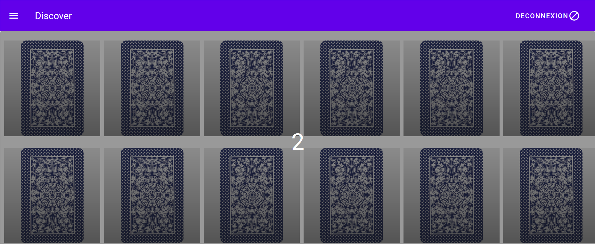
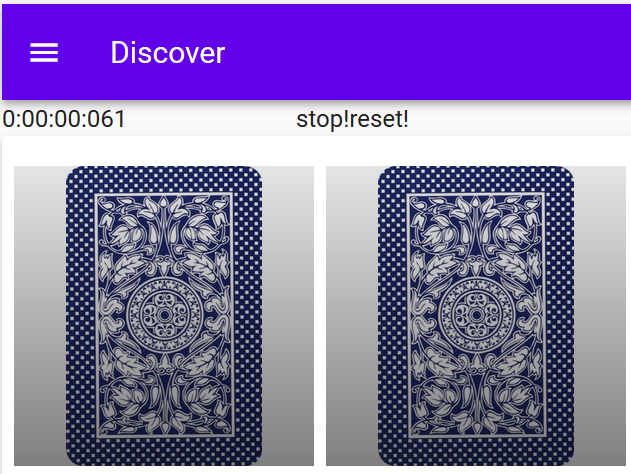

# Memory

## Website
```
https://erdane-first-app.glitch.me
```

## Game

### Connexion
Pour commencer à jouer, il faut tout d'abord se connecter :


Si c'est la première connexion, vous devez vous inscrire.
Entrez alors votre pseudo et votre mot de passe dans les champs de texte.

### Aide
Sur cette page vous trouverez une aide afin de connaitre les objectifs du jeu.


(AFFICHER DES MESSAGES SI LUTILISATEUR EST DEJA CONNECTER OU PAS DANS LA BASE)

### Jeu
Lors de la connexion, vous serez alors redirigé vers le jeu.


Notez lors du lancement du jeu, l'alerte de connection qui affiche avec quel nom d'utilisateur vous êtes connecté.


Une fois connecté, le jeu se lance automatiquement.
Un overlay vous indiquera le temps restant avant le début de la partie



Lorsque ce décompte arrive à terme, le chronomètre du jeu se met en marche.



![Jeu]
Le jeu se compose de paires de cartes portant des illustrations identiques. L'ensemble des cartes est mélangé, puis étalé face.
À son tour, le joueur retourne deux cartes de son choix. S'il découvre deux cartes identiques, il les ramasse et les conserve. Si les cartes ne sont pas identiques, il les retourne faces cachées à leur emplacement de départ.Et recommence à nouveau .

Le jeu se termine quand toutes les paires de cartes ont été découvertes et ramassées.
### Déconnexion
A tout moment vous pouvez vous déconnecter du jeu, à partir du bouton déconnexion


Lors de la déconnexion, vous serez alors redirigé vers la page de login


:warning: **Attention : si vous vous déconnecter votre jeu ne sera pas sauvegardé !**
